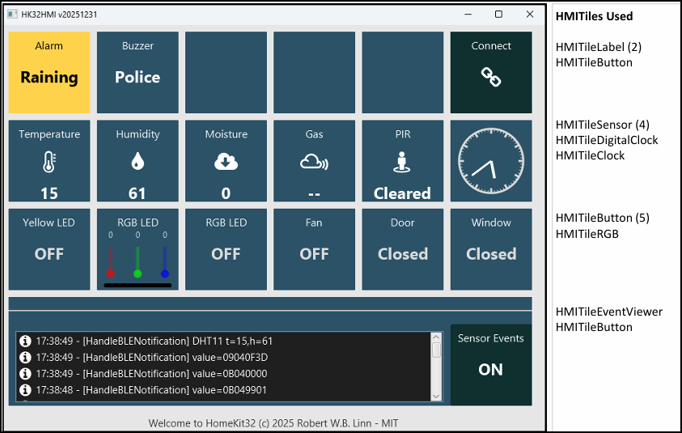
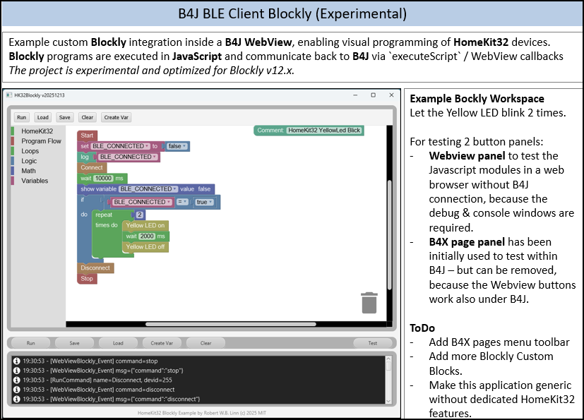

# HomeKit32

> This repository is provided for reference and learning purposes only; issue tracking is disabled.

**HomeKit32** is a modular smart-home automation framework for the  
Keyestudio Smart Home Kit (KS5009), powered by **ESP32, BLE, MQTT and B4X**.

It is a **personal hobby project** focused on clean architecture, education, and experimentation — **no commercial intention**.

---

## What It Is

HomeKit32 turns an ESP32-based Keyestudio smart-home kit into a flexible, multi-protocol automation platform with:

- BLE and MQTT communication
- Structured binary and JSON protocols
- Multiple desktop and mobile clients
- A visual **Blockly programming interface** integrated into B4J

The system is designed to be **easy to extend**, **easy to understand**, and **safe to experiment with**.

---

## Screenshots

---

## Core Components

- **Firmware**
  - ESP32 running **B4R**
  - BLE Peripheral + GATT Server (UART-style service)
  - Optional MQTT gateway
  - Performance-critical features implemented as wrapped C++ libraries

- **Client Applications**
  - **B4A** (Android HMI)
  - **B4J** (Desktop HMI)
  - **B4J + Blockly** (visual programming)
  - **Python (PySide6)** GUI client

---

## Supported Hardware

All **13 devices** from the Keyestudio KS5009 kit, including:

- LEDs (single + RGB)
- Relays
- Buttons
- PIR motion sensor
- Gas and steam sensors
- DHT11 / DHT22 temperature & humidity
- Servo motors (door / window)
- DC motor
- Buzzer
- LCD1602 display
- RFID module

---

## Communication

- **BLE**
  - Structured commands and notifications
  - Framed binary packets
  - Adjustable MTU and buffering
- **MQTT**
  - Optional integration
  - Compatible with Home Assistant and Mosquitto

---

## Visual Programming (Blockly)

- Blockly runs inside a **B4J WebView**
- Custom blocks for:
  - Devices (LEDs, door, sensors)
  - Loops and conditions
  - Delays and indicators
- Blockly programs are executed asynchronously and translated into BLE/MQTT commands.

---

## Project Status

- Firmware core: **stable**
- BLE protocol: **stable**
- MQTT gateway: **stable**
- Blockly integration: **experimental but functional**
- Actively developed and refactored as a learning project
This is a personal, non-commercial hobby project.

The repository is shared for learning and inspiration.
Issue tracking and feature requests are intentionally disabled.

---

## Documentation

Additional documentation is included in the repository:

- `DEV_NOTES.md` - Development guidelines and architecture
- `BLE_NOTES.md` - BLE services, characteristics, packet format
- `MQTT_NOTES.md` - MQTT topics and payloads

---

## Intended Use

- Learning ESP32, BLE, MQTT, and B4X
- Educational demos and workshops
- Rapid IoT prototyping
- Reference architecture for clean embedded design

**Not intended for production or commercial deployment.**

---

## License

- **HomeKit32** – MIT License © 2025-2026 Robert W. W. Linn
- Third-party libraries retain their original licenses (see LICENSE)

---

## Credits

- Keyestudio – Smart Home Kit KS5009
- Anywhere Software – B4X tools
- Blockly – Google / Raspberry Pi Foundation
